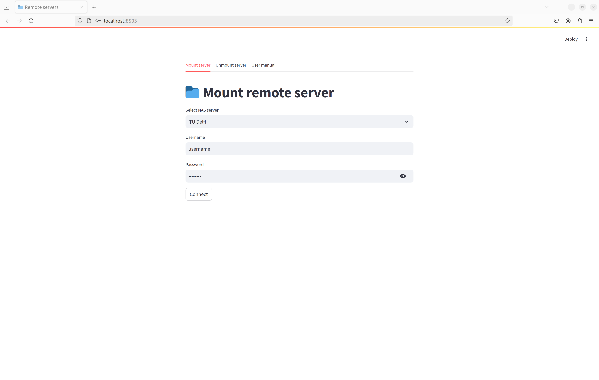

# Remote server connection via SFTP
## Overview

The present app is a user-friendly interface that allows users to easily mount SFTP servers onto their local Linux filesystem using `sshfs`. This app simplifies the process of managing remote file systems by providing a graphical interface to run the necessary `sshfs` commands behind the scenes.

## Features

- **Easy SFTP Mounting:** Mount and unmount SFTP servers with a few clicks.
- **User Authentication:** Securely input and manage credentials for SFTP servers.
- **Status Monitoring:** View the current status of mounted servers.
- **Error Handling:** Clear messages and logs for troubleshooting connection issues.
- **Streamlit Interface:** A modern and intuitive web interface powered by Streamlit.

## Prerequisites

Before you start, make sure you have the following installed on your Linux machine:

- Python 3.10 or higher
- `sshfs` package
- Streamlit
- PyYAML

You can install `sshfs` using your package manager. For example, on Ubuntu:

```bash
sudo apt-get install sshfs
```

## Installation

1. Clone the repository:

    ```bash
    git clone https://github.com/franciscopalmeromoya/servers
    ```

2. Install the required Python packages:

    ```bash
    pip install -r requirements.txt
    ```

## Usage

To run the app, navigate to the project directory and use the following command:

```bash
streamlit run app.py
```

This will start the Streamlit server and open the app in your default web browser. If it doesn't open automatically, you can navigate to `http://localhost:8503` in your browser.

## Configuration

The app allows you to configure multiple SFTP servers. Here’s how you can set it up:

1. **Add Server Details:** Input the server address, port (default is 22), username, and password (or use an SSH key if preferred).
2. **Mount Directory:** Specify the local directory where the SFTP server should be mounted.
3. **Mount/Unmount Actions:** Use the provided buttons to mount or unmount the SFTP server.

## Screenshots



## Troubleshooting

- **Permission Denied:** Ensure you have the necessary permissions to mount directories on your system.
- **SSHFS Not Found:** Make sure `sshfs` is installed and accessible in your system PATH.
- **Connection Issues:** Double-check the server details and credentials. Verify that the server is reachable.

## Contributing

Contributions are welcome! Please fork the repository and submit pull requests. For major changes, open an issue first to discuss what you would like to change.

## License

This project is licensed under the MIT License. See the `LICENSE` file for details.